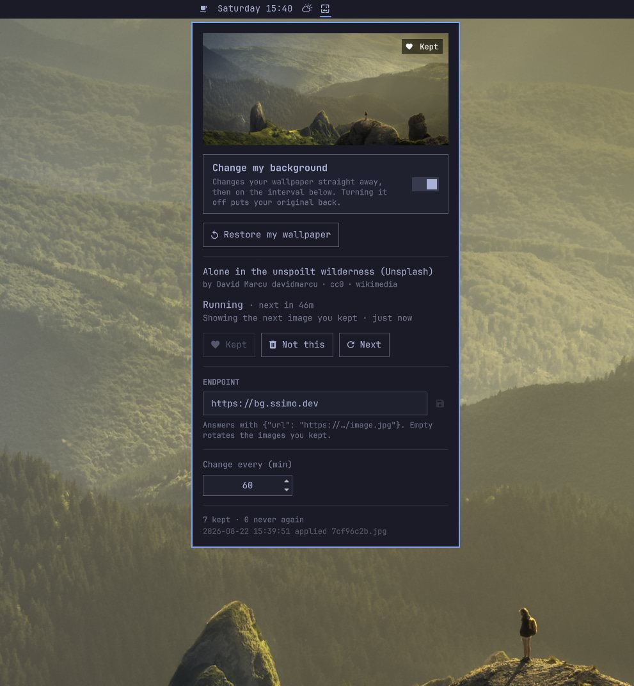

# bg-pasticcio




An Omarchy 4 ("Quattro") shell plugin that changes your desktop background on a
timer, pulling images from an HTTP JSON endpoint. An icon next to the clock
opens a panel to switch it on, point it at a feed, and keep or discard the
image on screen. Only the images you decide to keep are stored on disk, and they 
are what it rotates through when the endpoint cannot be reached.

It ships **off**, pointing at `https://bg.ssimo.dev` — a CC0 wallpaper
feed. Nothing is downloaded and no wallpaper is touched until you turn on
**Change my background**; turning it back off puts your original wallpaper
back.

## Requirements

Omarchy 4 with `omarchy-shell`. The worker uses `curl`, `jq`, `file`,
`sha256sum`, `find`, `flock` and `getent`, all present in a default Omarchy
install; it checks for them and says so in the log if one is missing. `magick`, `fc-match`
and `hyprctl` are optional and only affect the "configure me" notice
background.

## Install

```sh
omarchy plugin add https://github.com/WinCisky/bg-pasticcio.git --enable --yes
omarchy bar put ssimo.bg-pasticcio --after omarchy.clock
```

Nothing has changed yet — that is deliberate. Click the icon by the clock and
turn on **Change my background**; the wallpaper changes within a second or two.
The same from a terminal:

```sh
omarchy-shell bgpasticcio enable
```

Left-click the icon for the panel, right-click for a fresh image, middle-click
for the next one you kept. To use your own feed, paste its URL into the endpoint
field and press Enter — any endpoint works that answers with JSON containing at
least `{"url": "https://.../image.jpg"}`.

To stop: switch **Change my background** off (that restores your wallpaper),
then `omarchy plugin remove ssimo.bg-pasticcio`.

## Developing

Plain bash and QML — no build step and nothing to install. Clone it where the
shell looks for plugins, and enable it from there:

```sh
git clone https://github.com/WinCisky/bg-pasticcio.git \
  ~/.config/omarchy/plugins/ssimo.bg-pasticcio
omarchy plugin validate ~/.config/omarchy/plugins/ssimo.bg-pasticcio
omarchy-shell shell rescanPlugins
omarchy plugin enable ssimo.bg-pasticcio
omarchy bar put ssimo.bg-pasticcio --after omarchy.clock
```

Edit in place, then:

```sh
omarchy-restart-shell                              # after any QML edit — the shell caches compiled QML
cd ~/.config/omarchy/plugins/ssimo.bg-pasticcio
bin/bg-pasticcio enable && bin/bg-pasticcio run    # the worker runs standalone
bin/bg-pasticcio status | jq .
tail -f ~/.local/state/bg-pasticcio/bg-pasticcio.log
```

[CLAUDE.md](CLAUDE.md) has the rest: architecture, the worker's command
surface, config keys, on-disk layout, the endpoint contract, and the invariants
to preserve.

## What leaves your machine

Nothing while the toggle is off. Once on, every `BG_INTERVAL_MINUTES` it makes
two ordinary HTTPS requests — one to the endpoint, one to the image URL it
returns — with whatever your system `curl` sends by default. No identifiers, no
telemetry; keeps and discards are recorded locally and never reported. The
default endpoint is run by this plugin's author and sees what any web server
sees: your IP address and User-Agent. Point it elsewhere, or blank it to rotate
only what is already on disk, and it is never contacted again.

## License

MIT — see [LICENSE](LICENSE). Copyright (c) 2026 Simone Simonella.

The plugin ships no images of its own. Wallpapers come from whatever endpoint
you point it at, under that endpoint's terms; the default feed serves CC0
photography and sends the credit line the panel displays.
